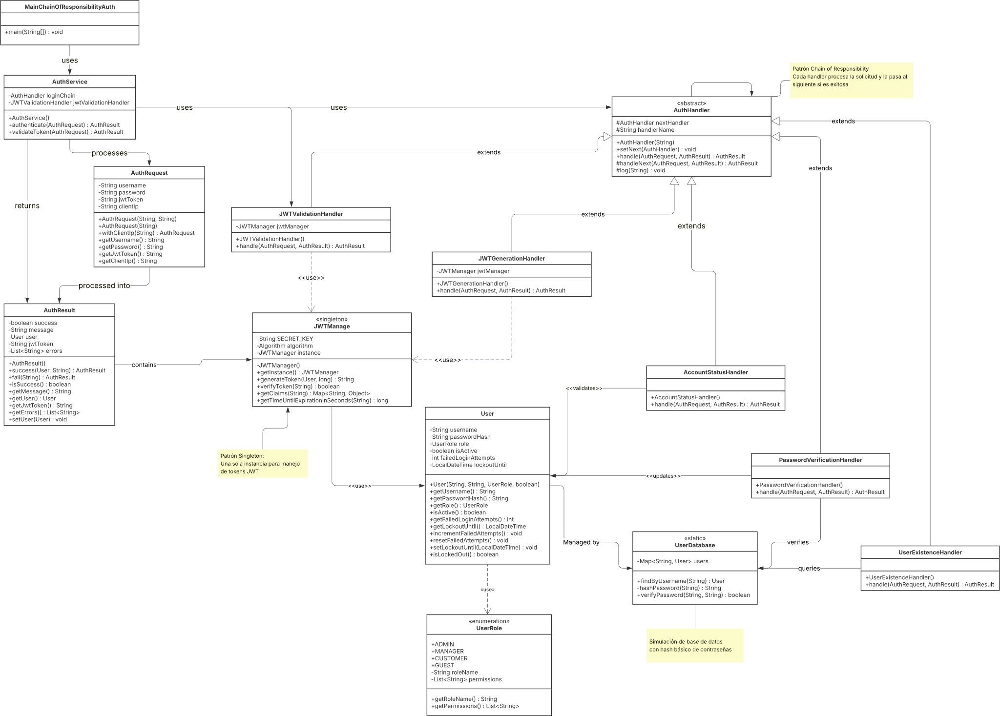
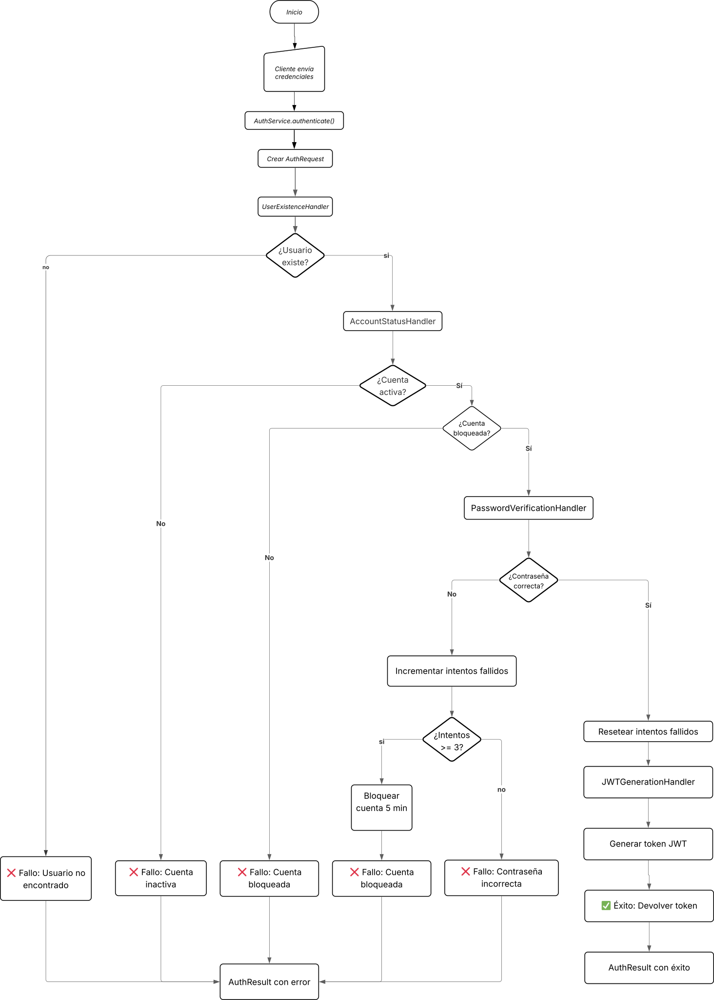
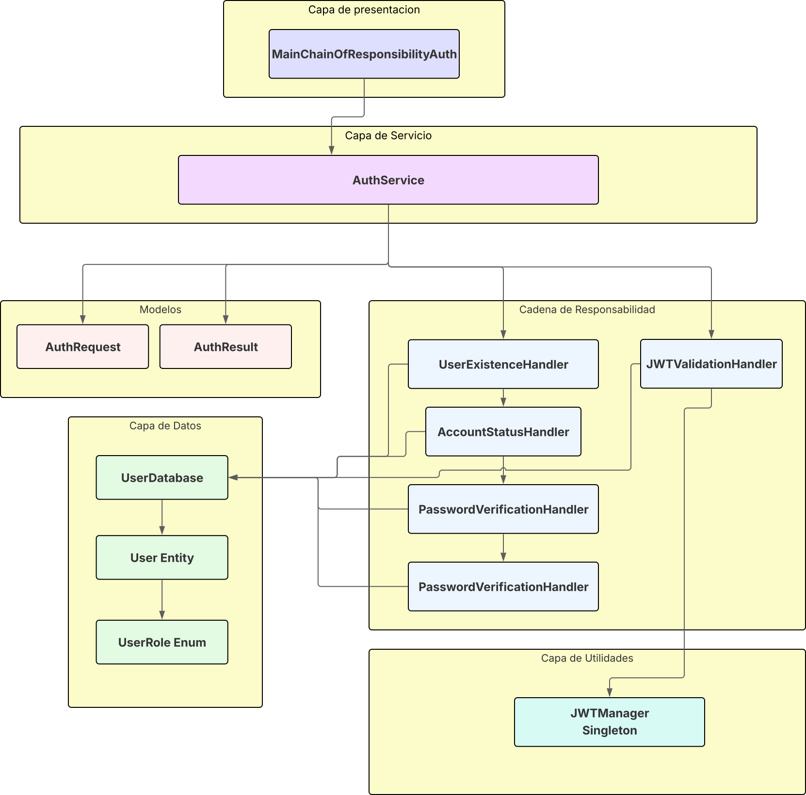

# Sistema de Autenticación Moderno

Un sistema de autenticación robusto y modular en Java que implementa el patrón **Cadena de Responsabilidad** (Chain of Responsibility) con gestión segura de JWT utilizando Auth0 java-jwt.

## 🚀 Características Principales

- **Autenticación Flexible**: Soporte para autenticación basada en usuario/contraseña
- **Gestión de JWTs Segura**: Generación y validación de tokens JWT con java-jwt
- **Patrón Cadena de Responsabilidad**: Proceso estructurado en pasos discretos y encadenados
- **Principios SOLID**: Diseño centrado en buenas prácticas de programación
- **Manejo de Roles y Permisos**: Sistema completo de autorización
- **Lógica de Seguridad**: Hashing de contraseñas y bloqueo por intentos fallidos

## 📁 Estructura del Proyecto

```
mi-proyecto-autenticacion/
├── src/
│   └── main/
│       └── java/
│           └── com/
│               └── example/
│                   └── auth/
│                       ├── MainChainOfResponsibilityAuth.java
│                       │
│                       ├── model/
│                       │   ├── User.java
│                       │   ├── UserRole.java
│                       │   ├── AuthRequest.java
│                       │   └── AuthResult.java
│                       │
│                       ├── service/
│                       │   ├── AuthService.java
│                       │   ├── UserDatabase.java
│                       │   └── JWTManager.java
│                       │
│                       └── handler/
│                           ├── AuthHandler.java
│                           ├── UserExistenceHandler.java
│                           ├── AccountStatusHandler.java
│                           ├── PasswordVerificationHandler.java
│                           ├── JWTGenerationHandler.java
│                           └── JWTValidationHandler.java
│
├── docs/
│   └── diagrams/
│       ├── DiagramadeArquitecturadelSistema.svg
│       ├── DiagramadeClasesServiciodeAutenticacionKodigo.svg
│       └── DiagramadeFlujoServiciodeAutenticacionKodigo.svg
│
└── pom.xml
```

### 🏗️ Componentes Clave

- **`model/`**: Entidades principales y objetos de transferencia de datos
- **`service/`**: Lógica de negocio central y gestión de JWT
- **`handler/`**: Implementación de la Cadena de Responsabilidad

## 📊 Diagramas del Proyecto

El proyecto incluye tres diagramas visuales para facilitar la comprensión:

1. **Diagrama de Clases**: Estructura estática del sistema UML
     
3. **Diagrama de Flujo**: Secuencia del proceso de autenticación
    
4. **Diagrama de Arquitectura**: Integración con componentes externos
    
## 🛠️ Requisitos del Sistema

- **Java Development Kit (JDK)**: Versión 11 o superior
- **Maven**: Para gestión de dependencias y construcción

## ⚙️ Configuración del Proyecto

### 1. Clonar el Repositorio

```bash
git clone https://github.com/tu-usuario/mi-proyecto-autenticacion.git
cd mi-proyecto-autenticacion
```

### 2. Configurar Dependencias

Asegúrate de que tu `pom.xml` contenga:

```xml
<?xml version="1.0" encoding="UTF-8"?>
<project xmlns="http://maven.apache.org/POM/4.0.0"
         xmlns:xsi="http://www.w3.org/2001/XMLSchema-instance"
         xsi:schemaLocation="http://maven.apache.org/POM/4.0.0 http://maven.apache.org/xsd/maven-4.0.0.xsd">
    <modelVersion>4.0.0</modelVersion>

    <groupId>org.kodigo</groupId>
    <artifactId>pratica_chain_of_responsability_auth</artifactId>
    <version>1.0-SNAPSHOT</version>

    <properties>
        <maven.compiler.source>24</maven.compiler.source>
        <maven.compiler.target>24</maven.compiler.target>
        <project.build.sourceEncoding>UTF-8</project.build.sourceEncoding>
    </properties>

    <dependencies>
        <!-- https://mvnrepository.com/artifact/com.auth0/java-jwt -->
        <dependency>
            <groupId>com.auth0</groupId>
            <artifactId>java-jwt</artifactId>
            <version>4.4.0</version>
        </dependency>
        <!-- https://mvnrepository.com/artifact/com.fasterxml.jackson.core/jackson-databind -->
        <dependency>
            <groupId>com.fasterxml.jackson.core</groupId>
            <artifactId>jackson-databind</artifactId>
            <version>2.19.0</version>
        </dependency>
    </dependencies>
</project>
```

### 3. Compilar el Proyecto

```bash
mvn clean install
```

## 🏃‍♂️ Ejecución del Proyecto

Para ejecutar la demostración del sistema:

```bash
mvn exec:java -Dexec.mainClass="com.example.auth.MainChainOfResponsibilityAuth"
```

Esto mostrará ejemplos de:
- Autenticación exitosa
- Autenticación fallida (contraseña incorrecta, cuenta bloqueada, etc.)
- Validación de JWTs

## 🤝 Contribuciones

¡Las contribuciones son bienvenidas! Si tienes sugerencias o mejoras:

1. Abre un **issue** para discutir los cambios
2. Envía un **pull request** con tus mejoras
---

**Desarrollado con ❤️ utilizando Java y principios SOLID**
